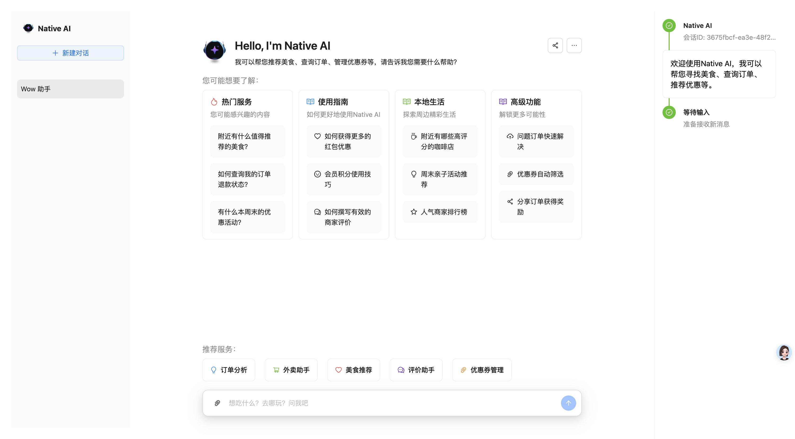

# Native AI - 个人智能助手

> **注意：** 项目目前正在积极探索和完善中，Multi Agent功能将不断迭代优化，敬请持续关注！

## 项目简介

Native AI 是一个探索本地生活电商领域的多智能体系统，通过 AI 助手一站式解决用户吃喝玩乐住行等日常生活需求。系统基于大语言模型技术，主要为了探索Multi Agent的应用。

<p align="center">
  
</p>

## 核心功能

- 🍔 **Multi Agent** - Multi Agent在本地生活电商场景的应用探索
- 🛒 **MCP** - MCP服务设计，资源整合
- 🎟️ **场景探索** - 以本地生活电商场景为例探索落地

## 技术架构

### 后端技术

- **框架**: FastAPI
- **AI引擎**: 基于大语言模型
- **工作流**: 基于LangGraph构建的多节点工作流
- **会话管理**: 维护用户对话状态和历史
- **MCP**: API已支持MCP协议

### 前端技术

- **框架**: React
- **状态管理**: 实时响应用户输入和系统反馈
- **UI组件**: 简洁直观的对话界面

## 快速开始

### 环境要求

- Python 3.9+
- Node.js 16+
- 相关API密钥

### 后端部署

```bash
# 克隆代码库
git clone https://github.com/yourusername/native-ai-agent.git
cd native-ai-agent/api

# 创建并激活虚拟环境
python -m venv venv
source venv/bin/activate  # Windows使用 venv\Scripts\activate

# 安装依赖
pip install -r requirements.txt

# 配置环境变量
cp .env.example .env
# 编辑.env文件，填入必要配置

# 启动服务
uvicorn app.main:app --reload
```

### 前端部署

```bash
# 进入前端目录
cd ../front

# 安装依赖
npm install

# 启动开发服务器
npm start
```

## 智能体系统架构

Native AI 采用基于图的多节点工作流架构:

1. **主控制器** - 理解用户输入并决定下一步行动
2. **工具模块** - 提供各类专业功能工具
3. **图构建器** - 创建和管理智能工作流
4. **会话管理** - 维护用户状态和上下文
5. **API端点** - 为前端提供统一接口

## 开发计划

- [ ] 增加更多本地生活场景支持
- [ ] 提升推理能力和决策质量
- [ ] 优化个性化推荐算法
- [ ] 完善用户界面和交互体验
- [ ] 增强多轮对话能力

## 贡献指南

我们欢迎社区贡献！如果您有兴趣参与项目开发:

1. Fork本仓库
2. 创建特性分支 (`git checkout -b feature/amazing-feature`)
3. 提交更改 (`git commit -m 'Add amazing feature'`)
4. 推送分支 (`git push origin feature/amazing-feature`)
5. 创建Pull Request

## 许可证

[MIT License](LICENSE)

---

**项目持续优化中** - 我们正努力打造更智能、更贴心的本地生活AI助手，敬请期待！
